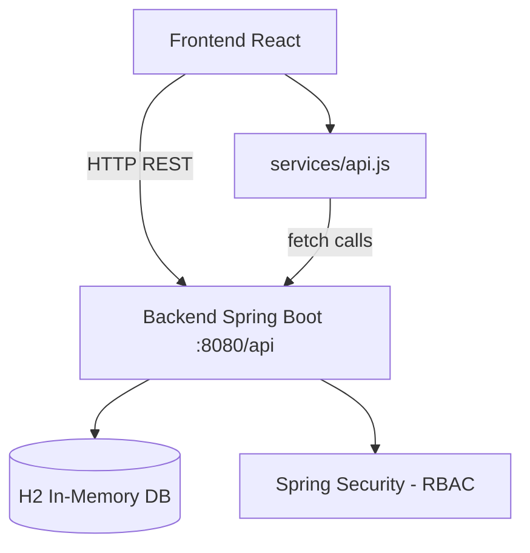

# 📋 Tổng quan dự án: SpecKit — Mini IT Recruitment Platform

## 🎯 Mục đích dự án

Đây là một **nền tảng tuyển dụng IT thu nhỏ** (tương tự ITviec), được xây dựng theo mô hình **full-stack** dành cho thị trường Việt Nam. Dự án phục vụ 4 loại người dùng:

| Vai trò | Mô tả |
|---|---|
| **Candidate** | Ứng viên tìm kiếm việc làm IT |
| **Recruiter** | Nhà tuyển dụng đăng tin và quản lý ứng viên |
| **Moderator** | Kiểm duyệt nội dung và xử lý báo cáo |
| **Admin** | Quản trị hệ thống và quản lý tài khoản |

---

## 🗂️ Cấu trúc thư mục

```
speckit-project/
├── backend/              ← Spring Boot (Java 21)
├── frontend/             ← React 19 + Vite
├── specs/                ← Tài liệu đặc tả kỹ thuật
│   ├── 001-mini-it-recruitment-platform/
│   └── 002-user-auth-flows/
└── .agents/skills/       ← Các kỹ năng AI (SpecKit workflow)
```

---

## 🖥️ BACKEND — Spring Boot

### Tech Stack
- **Java 21** + **Spring Boot 3.4.1**
- **Spring Security** — phân quyền theo role
- **Spring Data JPA** + **H2 Database** (in-memory, mode PostgreSQL)
- **Spring Validation** — kiểm tra dữ liệu đầu vào
- API prefix: `/api`, chạy ở port **8080**

### Cấu trúc packages

```
com.project.recruitment/
├── api/          ← Controllers (REST endpoints)
├── domain/       ← Entities (JPA models)
├── dto/          ← Request/Response objects
├── repository/   ← JPA Repositories
├── security/     ← Spring Security config
└── service/      ← Business logic
```

### Các Domain Entity chính

| Entity | Mô tả |
|---|---|
| `User` | Người dùng hệ thống, có role |
| `UserRole` | Enum: CANDIDATE, RECRUITER, MODERATOR, ADMIN |
| `CandidateProfile` | Hồ sơ ứng viên (skills, CV, kinh nghiệm) |
| `RecruiterProfile` | Hồ sơ nhà tuyển dụng |
| `Company` | Công ty tuyển dụng |
| `JobPosting` | Tin tuyển dụng (title, location, salary, skills) |
| `JobApplication` | Đơn ứng tuyển của candidate |
| `JobApplicationStatus` | Enum: SUBMITTED, REVIEWED, INTERVIEW, OFFER, REJECTED |
| `ModerationCase` | Vụ việc kiểm duyệt cần xử lý |
| `AuditLog` | Nhật ký hành động quan trọng |
| `Notification` | Thông báo cho người dùng |

### Controllers (API Endpoints)

| Controller | Chức năng |
|---|---|
| `AuthController` | Đăng ký, đăng nhập |
| `CandidateProfileController` | CRUD hồ sơ ứng viên |
| `JobController` | Xem và lọc danh sách việc làm |
| `JobApplicationController` | Nộp đơn, xem trạng thái đơn |
| `RecruiterController` | Quản lý tin đăng, xem ứng viên |
| `ModerationController` | Kiểm duyệt nội dung |
| `AdminController` | Quản trị tài khoản, role |
| `NotificationController` | Lấy và đánh dấu đã đọc thông báo |

---

## 🌐 FRONTEND — React

### Tech Stack
- **React 19** + **Vite 8**
- **React Router DOM 7** — điều hướng
- **Vitest** + **Testing Library** — unit testing
- Không dùng CSS framework bên ngoài (custom CSS thuần)

### Cấu trúc thư mục `src/`

```
src/
├── main.jsx              ← Entry point
├── App.jsx               ← Root component, quản lý role & state toàn cục
├── App.css / index.css   ← Global styles
├── components/           ← UI Components dùng chung
│   ├── Header.jsx        ← Thanh điều hướng, chọn role
│   ├── JobCard.jsx       ← Thẻ hiển thị tin tuyển dụng
│   ├── JobDetailModal.jsx← Popup chi tiết công việc
│   ├── ApplyModal.jsx    ← Form nộp đơn ứng tuyển
│   ├── ReportModal.jsx   ← Form báo cáo nội dung
│   ├── NotificationsDrawer.jsx ← Drawer thông báo
│   └── Toast.jsx         ← Thông báo popup tạm thời
├── pages/                ← Màn hình chính theo từng role
│   ├── CandidateView.jsx ← Giao diện ứng viên (duyệt & nộp đơn)
│   ├── CandidateDashboard.jsx ← Dashboard theo dõi đơn ứng tuyển
│   ├── RecruiterView.jsx ← Giao diện nhà tuyển dụng (đăng tin, xem đơn)
│   ├── ModeratorView.jsx ← Giao diện kiểm duyệt
│   └── AdminView.jsx     ← Giao diện quản trị
└── services/
    └── api.js            ← Tất cả API calls tới backend (~21KB)
```

### Cơ chế chuyển đổi Role (quan trọng!)

App.jsx quản lý **mock user session** bằng state. Người dùng có thể chuyển đổi giữa 4 role trực tiếp trên giao diện (Header). Mỗi role hiển thị một `View` khác nhau:

```
CANDIDATE  → CandidateView
RECRUITER  → RecruiterView
MODERATOR  → ModeratorView
ADMIN      → AdminView
```

> [!NOTE]
> Đây là thiết kế demo: không có login thật. Việc chuyển role được thực hiện bằng cách click trên Header.

---

## 📄 SPECS — Tài liệu đặc tả

### `specs/001-mini-it-recruitment-platform/`
Đặc tả tính năng chính của nền tảng tuyển dụng, bao gồm:

| File | Nội dung |
|---|---|
| `spec.md` | Đặc tả user stories, functional requirements (FR-001 → FR-015) |
| `plan.md` | Kế hoạch triển khai kỹ thuật |
| `tasks.md` | Danh sách task chi tiết |
| `data-model.md` | Sơ đồ dữ liệu |
| `research.md` | Research về thị trường, competitors |
| `quickstart.md` | Hướng dẫn chạy nhanh dự án |
| `contracts/api-contract.yaml` | OpenAPI contract |

### `specs/002-user-auth-flows/`
Đặc tả luồng xác thực người dùng (đăng ký, đăng nhập):

| File | Nội dung |
|---|---|
| `spec.md` | User stories & requirements cho auth |
| `plan.md` | Kế hoạch triển khai auth |
| `checklists/` | Checklist kiểm tra |

---

## 🤖 `.agents/skills/` — SpecKit AI Workflow

Đây là điểm đặc biệt: dự án có tích hợp **AI-driven development workflow** gồm các skill:

| Skill | Mô tả |
|---|---|
| `speckit-specify` | Tạo spec từ mô tả tính năng |
| `speckit-clarify` | Hỏi làm rõ yêu cầu |
| `speckit-plan` | Lập kế hoạch kỹ thuật |
| `speckit-tasks` | Sinh danh sách task |
| `speckit-implement` | Thực thi task tự động |
| `speckit-analyze` | Phân tích chất lượng artifacts |
| `speckit-converge` | Kiểm tra tính nhất quán giữa code & spec |
| `speckit-checklist` | Tạo checklist tùy chỉnh |
| `speckit-constitution` | Tạo/cập nhật nguyên tắc dự án |
| `speckit-taskstoissues` | Chuyển tasks thành GitHub Issues |

---

## 🔁 Luồng dữ liệu tổng quát



---

## 🚀 Tóm tắt nhanh

| Thành phần | Công nghệ | Ghi chú |
|---|---|---|
| Backend | Java 21, Spring Boot 3.4.1 | Port 8080, prefix `/api` |
| Database | H2 In-Memory | Mode PostgreSQL, có H2 Console |
| Frontend | React 19, Vite 8 | Port mặc định 5173 |
| Auth | Spring Security | RBAC 4 roles |
| Testing | Vitest (FE) + Spring Test (BE) | |
| AI Workflow | SpecKit skills | 10 skills phát triển có trợ lý AI |
